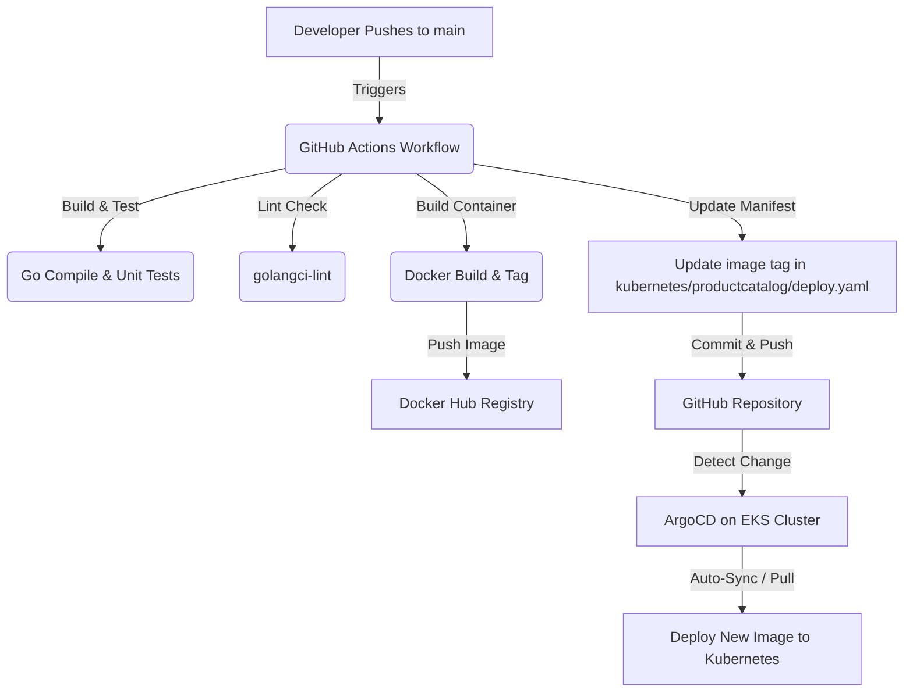

# 🚀 Run & CI/CD Automation Guide

This guide walks you through:
1. **Running the application locally** using Docker Compose.
2. **How the automated CI/CD pipeline works** when you push code.
3. **Automatically installing dependencies on your EC2 jumpbox** via Ansible.
4. **Provisioning AWS EKS Infrastructure** using Terraform.
5. **Configuring the pipeline secrets** on GitHub.
6. **Deploying with ArgoCD** to EKS in GitOps fashion.

---

## 💻 1. Running the Project Locally

Since the application consists of 20+ microservices (written in Go, Java, Python, Node.js, C++, Rust, and .NET) along with telemetry components (Grafana, Jaeger, Prometheus, OpenTelemetry Collector), Docker Compose is the recommended way to run it locally.

### Prerequisites
- Install **Docker** and **Docker Compose**.
- Make sure Docker is running on your machine.

### Run with Docker Compose
To start all services in the background:
```bash
docker compose up -d
```
*Note: If you have a Unix-like environment or `make` installed, you can also run `make start`.*

### Access the Services
Once all containers start successfully, you can access the following dashboards in your browser:

* **Astronomy Shop Frontend (UI):** [http://localhost:8080](http://localhost:8080)
* **Grafana (Metrics & Dashboards):** [http://localhost:8080/grafana/](http://localhost:8080/grafana/)
* **Jaeger (Distributed Tracing):** [http://localhost:8080/jaeger/ui](http://localhost:8080/jaeger/ui)
* **Load Generator (Locust UI):** [http://localhost:8080/loadgen/](http://localhost:8080/loadgen/)
* **Feature Flag UI (Flagd):** [http://localhost:8080/feature/](http://localhost:8080/feature/)

To stop all services:
```bash
docker compose down -v
```

---

## 🔄 2. How the Automated CI/CD Works

The project is wired with a **GitOps continuous delivery (CD)** pipeline using **GitHub Actions** and **ArgoCD**.

Here is how the automated workflow triggers and deploys updates to EKS:



### The CI/CD Steps:
1. **Git Push:** When you push changes (e.g. to `src/product-catalog/`) on the `main` branch, GitHub Actions is triggered.
2. **Build, Test & Lint:** The workflow builds the service binaries, runs unit tests, and performs code-quality linting.
3. **Containerization:** A Docker image is built for the modified service and pushed to Docker Hub with a unique build ID (GitHub Run ID).
4. **Manifest Update:** The workflow automatically updates the image tag inside `kubernetes/productcatalog/deploy.yaml` to point to the newly built image and commits/pushes it back to GitHub.
5. **GitOps CD (ArgoCD):** ArgoCD running on your EKS cluster monitors the Git repo. It automatically detects the updated image tag in `deploy.yaml` and deploys the new image to your cluster, making it live.

---

## 🛠️ 3. Automating EC2 Setup via Ansible

We have created an Ansible playbook under the `ansible` directory to automatically install **Docker**, **kubectl**, **Terraform**, and the **AWS CLI v2** on your EC2 jumpbox.

### Prerequisites
- Install **Ansible** on your local control machine:
  ```bash
  pip install ansible
  ```
- Obtain your EC2 jumpbox's **Public IP address** and your AWS SSH **Private Key (`.pem` file)**.

### Deployment Steps
1. Navigate to the `ansible` directory:
   ```bash
   cd ansible
   ```
2. Open [inventory.ini](file:///c:/Users/user/OneDrive/Desktop/devopsProject/ultimate-devops-project-demo/ansible/inventory.ini) and replace `YOUR_EC2_PUBLIC_IP` and the private key path with your actual details:
   ```ini
   [jumpbox]
   54.210.32.110 ansible_user=ubuntu ansible_ssh_private_key_file=/Users/user/.ssh/my-aws-key.pem
   ```
3. Run the playbook:
   ```bash
   ansible-playbook playbook.yml
   ```
   *(Ansible will connect to your EC2 instance and automatically install all tools, repositories, GPG keys, and configure permissions. This takes about 2-3 minutes).*

---

## 🏗️ 4. Provisioning EKS Infrastructure via Terraform

We have added Terraform configurations under the `EKS-Terraform` directory to automate setting up the AWS network and EKS cluster. You can choose to run this configuration locally or run it completely automatically using GitHub Actions.

### 🔒 Initial Setup: Remote State (Required for GitHub Actions Automation)
Because GitHub Actions runs on ephemeral (temporary) runners, it will lose local state files. To prevent Terraform from forgetting your cluster details:
1. Go to your AWS console and create an **S3 Bucket** (e.g., `my-unique-state-bucket-name`) in `us-east-1` to store the state.
2. Create a **DynamoDB Table** (e.g., `my-state-lock-table`) in `us-east-1` with a partition key named `LockID` (type `String`) to handle state locking.
3. Open [backend.tf](file:///c:/Users/user/OneDrive/Desktop/devopsProject/ultimate-devops-project-demo/EKS-Terraform/backend.tf) and replace the placeholders with your actual S3 bucket and DynamoDB table names:
   ```hcl
   bucket         = "my-unique-state-bucket-name"
   dynamodb_table = "my-state-lock-table"
   ```

---

### Option A: Automated Provisioning via GitHub Actions (Recommended)

This allows you to spin up or tear down your EKS cluster with a single click in GitHub without running commands locally.

#### Step 1: Add AWS Secrets to GitHub Repository
1. Go to your repository on GitHub ➔ **Settings** ➔ **Secrets and variables** ➔ **Actions**.
2. Click **New repository secret** and add:
   * **`AWS_ACCESS_KEY_ID`**: Your AWS IAM Access Key ID.
   * **`AWS_SECRET_ACCESS_KEY`**: Your AWS IAM Secret Access Key.

#### Step 2: Trigger EKS Deployment from GitHub Actions UI
1. Go to your repository on GitHub and click the **Actions** tab.
2. In the left sidebar under "Workflows", select **AWS EKS Infrastructure Provisioning**.
3. Click the **Run workflow** dropdown on the right side.
4. Select the action:
   * Choose **`apply`** to provision the EKS cluster (takes 10-15 minutes).
   * Choose **`destroy`** to completely delete the EKS cluster and VPC (to avoid AWS bills when you're done).
5. Click the green **Run workflow** button.

---

### Option B: Manual Provisioning via Local CLI

If you prefer to run the Terraform commands manually from your computer or EC2 jumpbox:

#### Prerequisites
- Install **Terraform CLI** locally.
- Run `aws configure` to set your local AWS Access Key and Secret Key.

#### Deployment Steps
1. Navigate to the Terraform directory:
   ```bash
   cd EKS-Terraform
   ```
2. Initialize Terraform (this will configure the backend and download provider plugins):
   ```bash
   terraform init
   ```
3. Generate and review the execution plan:
   ```bash
   terraform plan
   ```
4. Apply the configuration to provision the EKS cluster:
   ```bash
   terraform apply
   ```
   *(Enter `yes` when prompted. Wait 10-15 minutes for completion).*

---

### 🌐 Connecting `kubectl` to the Cluster
Once the EKS cluster is provisioned (either via GitHub Actions or locally), run the following command to download cluster credentials and configure `kubectl`:
```bash
aws eks update-kubeconfig --region us-east-1 --name otel-eks-cluster
```
Verify cluster access:
```bash
kubectl get nodes
```

---

## ⚙️ 5. Configuring the Pipeline on GitHub

To make the CI/CD pipeline work automatically on push:

### Step 1: Set up Repository Secrets
1. Go to your repository on GitHub.
2. Click **Settings** (top bar).
3. Under the left menu, expand **Secrets and variables** and select **Actions**.
4. Click the **New repository secret** button.
5. Add the following secrets:
   * **`DOCKER_USERNAME`**: Your Docker Hub username.
   * **`DOCKER_TOKEN`**: A Personal Access Token (PAT) created in your Docker Hub Account Settings under *Security > New Access Token*. *(Do not use your main Docker Hub password for security reasons).*

### Step 2: Grant Write Permissions to GitHub Actions Token
Since the GitHub Actions workflow commits the updated deployment manifest back to your repository, it needs write permissions.
1. In the repository **Settings** page, go to **Actions** (under the "Code and automation" section).
2. Select **General**.
3. Scroll down to **Workflow permissions**.
4. Select **Read and write permissions**.
5. Click **Save**.

---

## 🛠️ 6. Deploying with ArgoCD on EKS

To set up ArgoCD on your Kubernetes cluster to listen to this repository and pull live updates:

1. **Install Argo CD:**
   ```bash
   kubectl create namespace argocd
   kubectl apply -n argocd -f https://raw.githubusercontent.com/argoproj/argo-cd/stable/manifests/install.yaml
   ```

2. **Access Argo CD UI:**
   Expose the ArgoCD server:
   ```bash
   kubectl port-forward svc/argocd-server -n argocd 8080:443
   ```
   Open `https://localhost:8080` in your browser. Get the default admin password:
   ```bash
   kubectl -n argocd get secret argocd-initial-admin-secret -o jsonpath="{.data.password}" | base64 -d
   ```

3. **Register your Git repo in Argo CD:**
   * Click **Create Application**.
   * Name: `product-catalog`
   * Sync Policy: `Automatic` (with `Self Heal` enabled).
   * Repository URL: `<Your-GitHub-Repository-URL>`
   * Path: `kubernetes/productcatalog`
   * Destination Cluster: `https://kubernetes.default.svc`
   * Destination Namespace: `default`
   * Click **Create**.

Now, every code push to `main` will automatically trigger a build, update the manifest, and prompt ArgoCD to update the live environment within seconds!

---

## 🌐 7. Routing to your Custom Subdomain (frontend-live.kuamar.shop)

We have configured the frontend proxy service (`opentelemetry-demo-frontendproxy`) to be of type `LoadBalancer` which automatically spins up an AWS Classic Load Balancer.

Here is how to map your subdomain to the LoadBalancer:

### Step 1: Retrieve the LoadBalancer DNS Name
Once the cluster and applications are successfully deployed via the automated GitHub Actions pipeline, retrieve the DNS name of the LoadBalancer:
```bash
kubectl get svc opentelemetry-demo-frontendproxy
```
*Note: Under the `EXTERNAL-IP` column, you will see a value ending in `.elb.amazonaws.com` (e.g., `a1b2c3d4e5f6g7h8i9j0-1234567890.us-east-1.elb.amazonaws.com`). Copy this entire DNS name.*

### Step 2: Configure your DNS Provider (e.g., GoDaddy / AWS Route 53)
To point your custom subdomain (`frontend-live.kuamar.shop`) to the EKS application:
1. Log in to your domain registrar (e.g., GoDaddy) or DNS management console (e.g., AWS Route 53 Hosted Zone).
2. Create a new DNS record:
   - **Type:** `CNAME`
   - **Name / Host:** `frontend-live`
   - **Value / Points to:** Paste the LoadBalancer DNS Address you copied in Step 1 (e.g., `a1b2c3d4e5f6g7h8i9j0-1234567890.us-east-1.elb.amazonaws.com`).
   - **TTL:** `1 hour` (or default)
3. Save the record.

Once the DNS propagates (usually within a few minutes), you can access your live microservices store at [http://frontend-live.kuamar.shop](http://frontend-live.kuamar.shop)!
