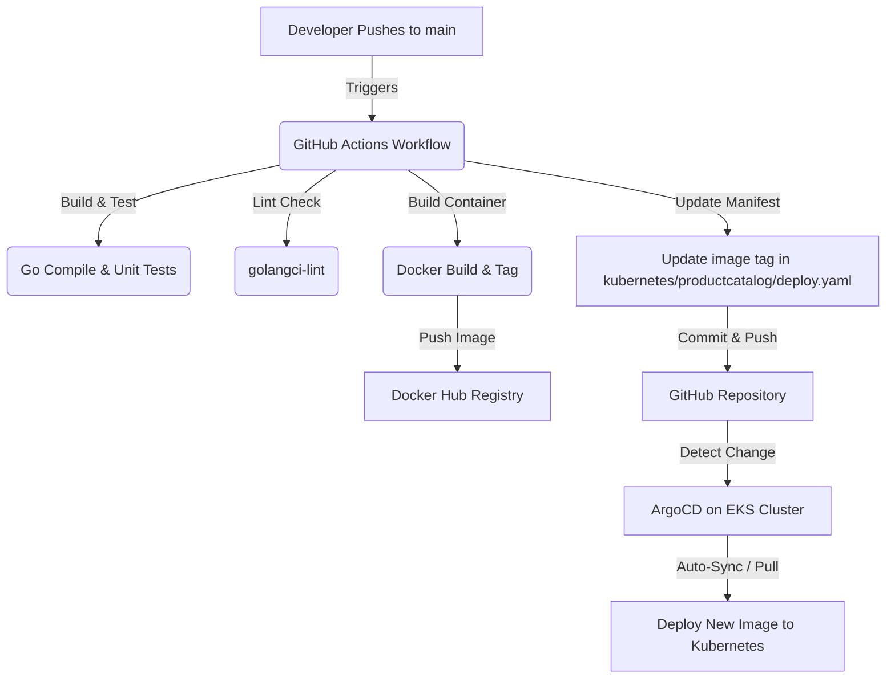

# 🚀 Run & CI/CD Automation Guide

This guide walks you through:
1. **Running the application locally** using Docker Compose.
2. **How the automated CI/CD pipeline works** when you push code.
3. **Step-by-step instructions to configure secrets** and trigger deployments.

---

## 💻 1. Running the Project Locally

Since the application consists of 20+ microservices (written in Go, Java, Python, Node.js, C++, Rust, and .NET) along with telemetry components (Grafana, Jaeger, Prometheus, OpenTelemetry Collector), Docker Compose is the recommended way to run it locally.

### Prerequisites
- Install **Docker** and **Docker Compose**.
- Make sure Docker is running on your machine.

### Run with Docker Compose
To start all services in the background:
```bash
docker compose up -d
```
*Note: If you have a Unix-like environment or `make` installed, you can also run `make start`.*

### Access the Services
Once all containers start successfully, you can access the following dashboards in your browser:

* **Astronomy Shop Frontend (UI):** [http://localhost:8080](http://localhost:8080)
* **Grafana (Metrics & Dashboards):** [http://localhost:8080/grafana/](http://localhost:8080/grafana/)
* **Jaeger (Distributed Tracing):** [http://localhost:8080/jaeger/ui](http://localhost:8080/jaeger/ui)
* **Load Generator (Locust UI):** [http://localhost:8080/loadgen/](http://localhost:8080/loadgen/)
* **Feature Flag UI (Flagd):** [http://localhost:8080/feature/](http://localhost:8080/feature/)

To stop all services:
```bash
docker compose down -v
```

---

## 🔄 2. How the Automated CI/CD Works

The project is wired with a **GitOps continuous delivery (CD)** pipeline using **GitHub Actions** and **ArgoCD**.

Here is how the automated workflow triggers and deploys updates to EKS:



### The CI/CD Steps:
1. **Git Push:** When you push changes (e.g. to `src/product-catalog/`) on the `main` branch, GitHub Actions is triggered.
2. **Build, Test & Lint:** The workflow builds the service binaries, runs unit tests, and performs code-quality linting.
3. **Containerization:** A Docker image is built for the modified service and pushed to Docker Hub with a unique build ID (GitHub Run ID).
4. **Manifest Update:** The workflow automatically updates the image tag inside `kubernetes/productcatalog/deploy.yaml` to point to the newly built image and commits/pushes it back to GitHub.
5. **GitOps CD (ArgoCD):** ArgoCD running on your EKS cluster monitors the Git repo. It automatically detects the updated image tag in `deploy.yaml` and deploys the new image to your cluster, making it live.

---

## ⚙️ 3. Configuring the Pipeline on GitHub

To make the CI/CD pipeline work automatically on push:

### Step 1: Set up Repository Secrets
1. Go to your repository on GitHub.
2. Click **Settings** (top bar).
3. Under the left menu, expand **Secrets and variables** and select **Actions**.
4. Click the **New repository secret** button.
5. Add the following secrets:
   * **`DOCKER_USERNAME`**: Your Docker Hub username.
   * **`DOCKER_TOKEN`**: A Personal Access Token (PAT) created in your Docker Hub Account Settings under *Security > New Access Token*. *(Do not use your main Docker Hub password for security reasons).*

### Step 2: Grant Write Permissions to GitHub Actions Token
Since the GitHub Actions workflow commits the updated deployment manifest back to your repository, it needs write permissions.
1. In the repository **Settings** page, go to **Actions** (under the "Code and automation" section).
2. Select **General**.
3. Scroll down to **Workflow permissions**.
4. Select **Read and write permissions**.
5. Click **Save**.

---

## 🛠️ 4. Deploying with ArgoCD on EKS

To set up ArgoCD on your Kubernetes cluster to listen to this repository and pull live updates:

1. **Install Argo CD:**
   ```bash
   kubectl create namespace argocd
   kubectl apply -n argocd -f https://raw.githubusercontent.com/argoproj/argo-cd/stable/manifests/install.yaml
   ```

2. **Access Argo CD UI:**
   Expose the ArgoCD server:
   ```bash
   kubectl port-forward svc/argocd-server -n argocd 8080:443
   ```
   Open `https://localhost:8080` in your browser. Get the default admin password:
   ```bash
   kubectl -n argocd get secret argocd-initial-admin-secret -o jsonpath="{.data.password}" | base64 -d
   ```

3. **Register your Git repo in Argo CD:**
   * Click **Create Application**.
   * Name: `product-catalog`
   * Sync Policy: `Automatic` (with `Self Heal` enabled).
   * Repository URL: `<Your-GitHub-Repository-URL>`
   * Path: `kubernetes/productcatalog`
   * Destination Cluster: `https://kubernetes.default.svc`
   * Destination Namespace: `default`
   * Click **Create**.

Now, every code push to `main` will automatically trigger a build, update the manifest, and prompt ArgoCD to update the live environment within seconds!
